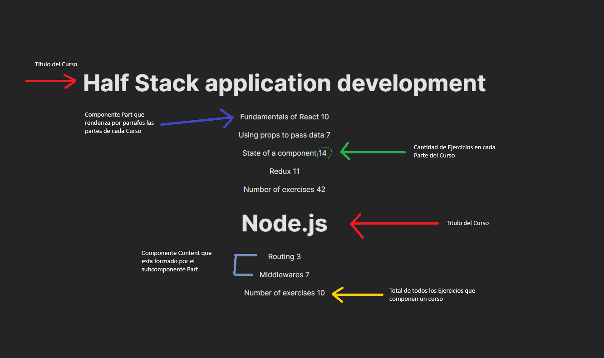

# React + Vite

This template provides a minimal setup to get React working in Vite with HMR and some ESLint rules.

Currently, two official plugins are available:

- [@vitejs/plugin-react](https://github.com/vitejs/vite-plugin-react/blob/main/packages/plugin-react/README.md) uses [Babel](https://babeljs.io/) for Fast Refresh
- [@vitejs/plugin-react-swc](https://github.com/vitejs/vite-plugin-react-swc) uses [SWC](https://swc.rs/) for Fast Refresh

# Explicacion de la Aplicacion

Esta Aplicacion muestra los cursos que vienen de un Arreglo.

Muestra el titulo de los cursos y cada parte que compone el curso y la cantidad de ejercicios que componen cada parte

Y el total de ejercicios que componen el curso completo

## Componente Course

Este componente es el que recibe los datos del Array que vienen desde App.jsx

Este componente usa otros componentes para renderizar su contenido

Utiliza el componente Content para renderizar por parrafos las partes que componen cada curso, el componente Content a su vez utiliza el componente Part para hacer el renderizado de cada parte de forma arbitraria

Y el componente Course utiliza el subcomponente Total para renderizar la suma total de los ejercicios que componen cada curso 

# Salida de la Aplicacion

