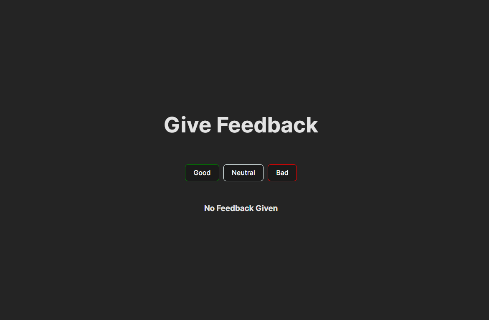
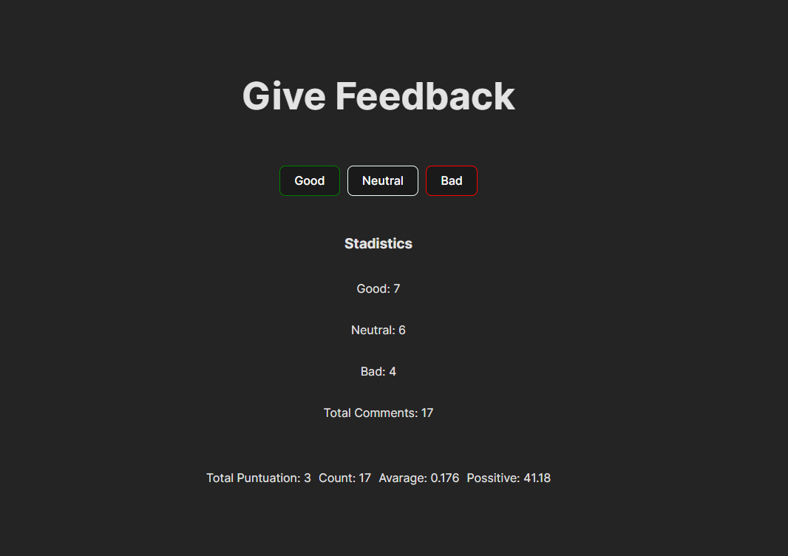

# React + Vite

This template provides a minimal setup to get React working in Vite with HMR and some ESLint rules.

Currently, two official plugins are available:

- [@vitejs/plugin-react](https://github.com/vitejs/vite-plugin-react/blob/main/packages/plugin-react/README.md) uses [Babel](https://babeljs.io/) for Fast Refresh
- [@vitejs/plugin-react-swc](https://github.com/vitejs/vite-plugin-react-swc) uses [SWC](https://swc.rs/) for Fast Refresh


## Explicacion de la Aplicacion

Como la mayoría de las empresas, Unicafe recopila comentarios de sus clientes. Tu tarea es implementar una aplicación web para recopilar comentarios de los clientes. Solo hay tres opciones para los comentarios: good (bueno), neutral y bad(malo).

La aplicación debe mostrar el número total de comentarios recopilados para cada categoría.

Tu aplicación final podría verse así:


Ten en cuenta que tu aplicación debe funcionar solo durante una única sesión del navegador. Una vez que se actualice la página, los comentarios recopilados pueden desaparecer.

## Explicacion separada en Puntos
Aqui ire agregando los puntos que el reto solicitaba para ir modificando la aplicacion

### 1.6: unicafe, paso 1

Como la mayoría de las empresas, Unicafe recopila comentarios de sus clientes. Tu tarea es implementar una aplicación web para recopilar comentarios de los clientes. Solo hay tres opciones para los comentarios: good (bueno), neutral y bad(malo).

Ten en cuenta que tu aplicación debe funcionar solo durante una única sesión del navegador. Una vez que se actualice la página, los comentarios recopilados pueden desaparecer.

Podrías usar el siguiente código como punto de partida para el archivo App.jsx:

```react
import { useState } from 'react'

const App = () => {
  // guarda los clics de cada botón en su propio estado
  const [good, setGood] = useState(0)
  const [neutral, setNeutral] = useState(0)
  const [bad, setBad] = useState(0)

  return (
    <div>
      code here
    </div>
  )
}

export default App
```

### 1.7: unicafe, paso 2

Amplía tu aplicación para que muestre más estadísticas sobre los comentarios recopilados: el número total de comentarios recopilados, la puntuación promedio (buena: 1, neutral: 0, mala: -1) y el porcentaje de comentarios positivos.


### 1.8: unicafe, paso 3

Refactoriza tu aplicación para que la visualización de las estadísticas se extraiga en su propio componente Statistics. El estado de la aplicación debe permanecer en el componente raíz App.

Recuerda que los componentes no deben definirse dentro de otros componentes:

```react
// un lugar adecuado para definir un componente
const Statistics = (props) => {
  // ...
}

const App = () => {
  const [good, setGood] = useState(0)
  const [neutral, setNeutral] = useState(0)
  const [bad, setBad] = useState(0)

  // no definas componentes adentro de otro componente
  const Statistics = (props) => {
    // ...
  }

  return (
    // ...
  )
}
```

### 1.9: unicafe paso 4

Cambia tu aplicación para mostrar estadísticas solo una vez que se hayan recopilado los comentarios.

```react
if (props.total === 0) {
        return (
            <>
                <div className="container-stadistics">
                    <h3>No Feedback Given</h3>
                </div>
            </>
        )
    }
```

### 1.10: unicafe paso 5

Continuemos refactorizando la aplicación. Extrae los siguiente dos componentes:

Button para definir los botones utilizados para enviar comentarios
StatisticLine para mostrar una única estadística, por ejemplo, la puntuación media.
Para ser claros: el componente StatisticLine siempre muestra una única estadística, lo que significa que la aplicación utiliza varios componentes para representar todas las estadísticas:

```react
const Statistics = (props) => {
  /// ...
  return(
    <div>
      <StatisticLine text="good" value ={...} />
      <StatisticLine text="neutral" value ={...} />
      <StatisticLine text="bad" value ={...} />
      // ...
    </div>
  )
}
```

El estado de la aplicación aún debe mantenerse en el componente raíz App.

### 1.11*: unicafe, paso 6
Este paso yo no lo realice, modifique un poco el CSS de la aplicacion por lo que considero que quedo mas pulido sin la tabla

Muestra las estadísticas en una tabla HTML, de modo que tu aplicación se vea más o menos así:


# Salida de la aplicacion
Aqui encontraras lo que la aplicacion mostrara en el front segun el caso de uso:

## Aplicacion sin datos:



## Aplicacion con Datos

