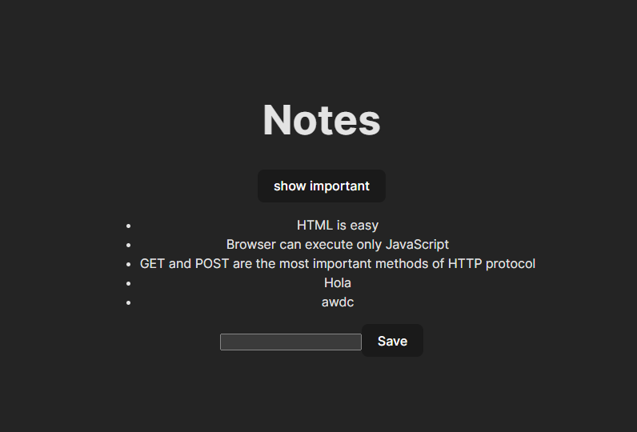

# React + Vite

This template provides a minimal setup to get React working in Vite with HMR and some ESLint rules.

Currently, two official plugins are available:

- [@vitejs/plugin-react](https://github.com/vitejs/vite-plugin-react/blob/main/packages/plugin-react/README.md) uses [Babel](https://babeljs.io/) for Fast Refresh
- [@vitejs/plugin-react-swc](https://github.com/vitejs/vite-plugin-react-swc) uses [SWC](https://swc.rs/) for Fast Refresh


# Explicacion de la aplicacion

Se creo una aplicacion que guarde notas en el estado del componente

## Guardando las notas en el estado del componente

Para que nuestra página se actualice cuando se agregan nuevas notas, es mejor almacenar las notas en el estado del componente App. Importemos la función useState y usémosla para definir una parte del estado que se inicializa con la matriz de notas inicial pasada en los props.
Las props de App vienen desde el archivo Main.jsx

```react
import { useState } from 'react'
import Note from './components/Note'

const App = (props) => {
  const [notes, setNotes] = useState(props.notes)

  return (
    <div>
      <h1>Notes</h1>
      <ul>
        {notes.map(note => 
          <Note key={note.id} note={note} />
        )}
      </ul>
    </div>
  )
}

export default App 
```


Si quisiéramos comenzar con una lista vacía de notas, estableceríamos el valor inicial como una matriz vacía, y dado que los props no se usarían, podríamos omitir el parámetro props de la definición de la función:

```react
const App = () => { 
  const [notes, setNotes] = useState([]) 

  // ...
}  

```


Sigamos con el valor inicial pasado en los props por el momento.

A continuación, agreguemos un formulario HTML al componente que se utilizará para agregar nuevas notas.

```react
const App = (props) => {
  const [notes, setNotes] = useState(props.notes)


  const addNote = (event) => {
    event.preventDefault()
    console.log('button clicked', event.target)
  }

  return (
    <div>
      <h1>Notes</h1>
      <ul>
        {notes.map(note => 
          <Note key={note.id} note={note} />
        )}
      </ul>

      <form onSubmit={addNote}>
        <input />
        <button type="submit">save</button>
      </form>   
    </div>
  )
}
```


Hemos agregado la función addNote como un controlador de eventos al elemento del formulario que se llamará cuando se envíe el formulario, haciendo clic en el botón submit.


## Componentes controlados
Hay muchas maneras de lograr esto; el primer método que veremos es mediante el uso de los llamados componentes controlados.

Agreguemos un nuevo estado llamado newNote para almacenar la entrada enviada por el usuario y configurémoslo en el input:

Para habilitar la edición del input, tenemos que registrar un controlador de eventos que sincronice los cambios realizados en la entrada con el estado del componente:


```react
const App = (props) => {
  const [notes, setNotes] = useState(props.notes)
  const [newNote, setNewNote] = useState(
    'a new note...'
  ) 

  // ...


  const handleNoteChange = (event) => {
    console.log(event.target.value)
    setNewNote(event.target.value)
  }

  return (
    <div>
      <h1>Notes</h1>
      <ul>
        {notes.map(note => 
          <Note key={note.id} note={note} />
        )}
      </ul>
      <form onSubmit={addNote}>
        <input
          value={newNote}

          onChange={handleNoteChange}
        />
        <button type="submit">save</button>
      </form>   
    </div>
  )
}
```

Ahora hemos registrado un controlador de eventos en el atributo onChange del elemento input del formulario:

```react
<input
  value={newNote}
  onChange={handleNoteChange}
/>
```

Se llama al controlador de eventos cada vez que ocurre un cambio en el elemento input. La función del controlador de eventos recibe el objeto de evento como su parámetro event:

```react
const handleNoteChange = (event) => {
  console.log(event.target.value)
  setNewNote(event.target.value)
}
```

La propiedad target del objeto de evento ahora corresponde al elemento input controlado y event.target.value se refiere al valor de entrada de ese elemento.

Ten en cuenta que no necesitamos llamar al método event.preventDefault() como hicimos en el controlador de eventos onSubmit. Esto se debe a que no se produce una acción predeterminada en un cambio de input, a diferencia de lo que ocurre con el envío de un formulario.

## Completar el addNote

Ahora el estado del componente newNote de App refleja el valor actual del input, lo que significa que podemos completar la función addNote para crear nuevas notas:

```react
const addNote = (event) => {
  event.preventDefault()
  const noteObject = {
    content: newNote,
    important: Math.random() < 0.5,
    id: notes.length + 1,
  }

  setNotes(notes.concat(noteObject))
  setNewNote('')
}
```
- Primero creamos un nuevo objeto para la nota llamado noteObject que recibirá su contenido del estado del componente newNote. El identificador único id se genera en función del número total de notas. Este método funciona para nuestra aplicación ya que las notas nunca se eliminan. Con la ayuda de la función Math.random(), nuestra nota tiene un 50% de posibilidades de ser marcada como importante.

- La nueva nota se agrega a la lista de notas usando el método de matriz concat.


## Filtrado de elementos mostrados

Agreguemos una nueva funcionalidad a nuestra aplicación que nos permita ver solo las notas importantes.

Agreguemos un fragmento de estado al componente App que realiza un seguimiento de las notas que deben mostrarse:

```react
const App = (props) => {
  const [notes, setNotes] = useState(props.notes) 
  const [newNote, setNewNote] = useState('')

  const [showAll, setShowAll] = useState(true)
  
  // ...
}
```

Cambiemos el componente para que almacene una lista de todas las notas que se mostrarán en la variable notesToShow. Los elementos de la lista dependen del estado del componente:

```react
import React, { useState } from 'react'
import Note from './components/Note'

const App = (props) => {
  const [notes, setNotes] = useState(props.notes)
  const [newNote, setNewNote] = useState('') 
  const [showAll, setShowAll] = useState(true)

  // ...


  const notesToShow = showAll
    ? notes
    : notes.filter(note => note.important === true)

  return (
    <div>
      <h1>Notes</h1>
      <ul>

        {notesToShow.map(note =>
          <Note key={note.id} note={note} />
        )}
      </ul>
      // ...
    </div>
  )
}
```

Si el valor de showAll es falso, la variable notesToShow se asignará a una lista que solo contiene notas que tienen la propiedad important establecida en true. El filtrado se realiza con la ayuda del método de matriz filter:

notes.filter(note => note.important === true)


## Mostrar las notas importantes o todas las notas

A continuación, agreguemos una funcionalidad que permita a los usuarios alternar el estado showAll de la aplicación desde la interfaz de usuario.

Los cambios relevantes se muestran a continuación:

```react
import React, { useState } from 'react'
import Note from './components/Note'

const App = (props) => {
  const [notes, setNotes] = useState(props.notes) 
  const [newNote, setNewNote] = useState('')
  const [showAll, setShowAll] = useState(true)

  // ...

  return (
    <div>
      <h1>Notes</h1>

      <div>
        <button onClick={() => setShowAll(!showAll)}>
          show {showAll ? 'important' : 'all' }
        </button>
      </div>
      <ul>
        {notesToShow.map(note =>
          <Note key={note.id} note={note} />
        )}
      </ul>
      // ...
    </div>
  )
}
```


Las notas mostradas (todas versus las importantes) se controlan con un botón. El controlador de eventos para el botón es tan simple que se ha definido directamente en el atributo del elemento del botón. El controlador de eventos cambia el valor de showAll de verdadero a falso y viceversa:

El texto del botón depende del valor del estado de showAll

## Salida de la aplicacion


### Mostrar todas las notas



### Mostrar solo las notas importantes


